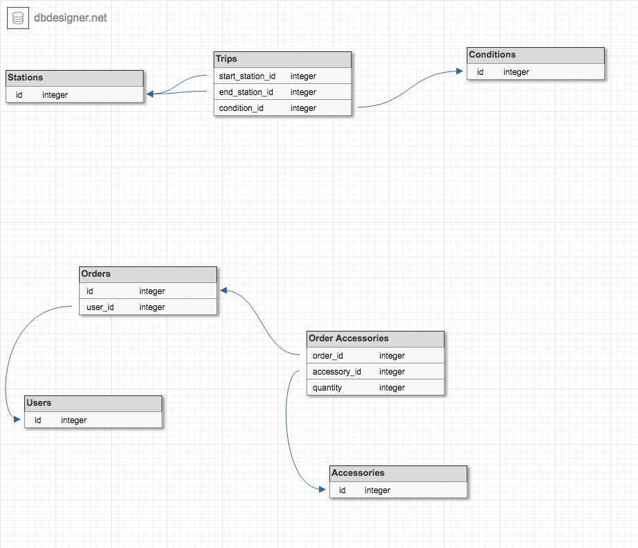

## Schema

# Bike Share SF

This is a site that analyzes bike share usage in San Francisco and creates a platform for a user to purchase bike accessories via an online store. The application is built in Ruby/Rails using a postgresql database and paperclip for image handling. You can visit the current version of the app, hosted on Heroku, here: https://bike-share-sf.herokuapp.com/ This project was created by students at the Turing School of Software and Design halfway through the Backend Engineering program.

## Getting Started

To run this application locally, clone this repo and follow the steps below:

`$ bundle`

`$ rake db:create db:migrate db:seed`

Start up your rails server with `rails s`
and open localhost:3000 in your browser.

### Prerequisites

Ruby Version: 2.4.1

## Running the tests

run `rspec` to run the test suite

## More Information

* Paperclip - https://github.com/thoughtbot/paperclip
* Heroku - https://devcenter.heroku.com/articles/getting-started-with-rails5
